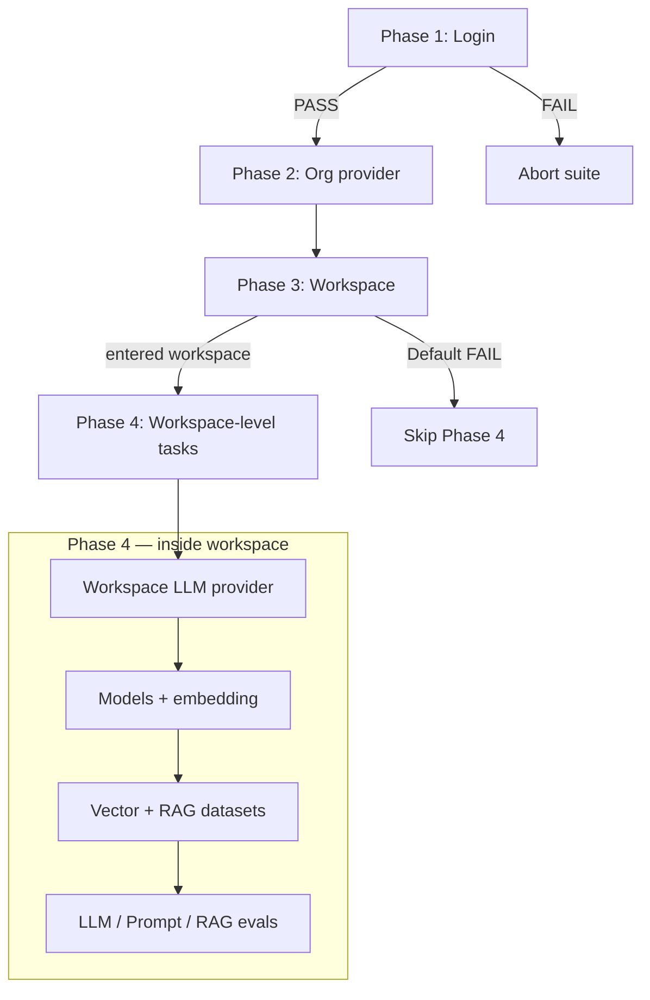

# FloTorch QA Automation — Execution Flow Overview

This document captures the **target** test-case flow you described. It is the blueprint for refactoring `build_task_workflow` and `build_run_context`. Step-by-step UI instructions will be added in follow-up messages.

---

## High-level phases



**Runtime:** `main.py` runs **11 phases** as separate `Agent.run()` calls (same Chrome session):

| Phase | Task |
|-------|------|
| 1 | Login |
| 2 | Org provider |
| 3 | Workspace create + enter |
| 4 | Workspace LLM provider |
| 5 | Models (chat + embedding) |
| 6 | Vector storage providers |
| 7 | Vector repositories |
| 8 | Datasets (LLM, then RAG) |
| 9 | Evaluations: LLM → Prompt → RAG |
| 10 | Prompt Partials + Playground |
| 11 | Close suite (FINAL SUMMARY) |

| Phase | Test case | Gate |
|-------|-----------|------|
| 1 | TC-01 Login | **Hard gate** — no downstream steps |
| 2 | TC-02 Organization provider | Soft skip sections if no credentials |
| 3–4 | TC-03/04 Workspace | **Hard gate for workspace scope** — Default Workspace failure fails all in-workspace tests |
| 5–12 | Model registry, vector, dataset, evals | Run only inside a valid workspace |

---

## TC-01 — Login (unchanged concept)

- Navigate to QA console, sign in with `FLOTORCH_EMAIL` / `FLOTORCH_PASSWORD`.
- **PASS** → continue.
- **FAIL** → stop; report login only (already implemented in `main.py`).

---

## TC-02 — Organization (global) provider

**Screen:** Provider → Create Organization Provider.

### Provider selection priority

1. **Amazon Bedrock** — if `AMAZON_BEDROCK_*` keys are complete in `.env`:
   - Create org provider (name slug + run uid).
   - **Service** dropdown: tick **every** Service option (mandatory multi-select).
   - **Type:** tick **all** Type options when shown (same rule as Service).
   - Enables downstream **Amazon Bedrock guardrail** scenarios.
2. **OpenAI** — if Bedrock not configured, or as second org provider when both exist (TBD: one org provider vs two — see open questions):
   - Same flow; **Type = all available types**.
3. **Fallback** — if neither Bedrock nor OpenAI is configured:
   - Use the **first provider** detected from `.env` (existing `PROVIDERS` ordering: env file order → registration order).

### Reporting when credentials missing

| Condition | Report note | Impact |
|-----------|-------------|--------|
| No Amazon Bedrock in `.env` | Cannot test Amazon Bedrock guardrail scenarios | Guardrail-related cases **SKIP** |
| No OpenAI in `.env` | See vector/RAG section | Blocks pinecone/chroma/lancedb/pg-vector vector paths |

**Current code today:** Step 2 creates only **one** org provider = first detected provider in `.env` order — no Bedrock/OpenAI priority, no “all types”, no guardrail flag.

---

## TC-03 / TC-04 — Workspace create and enter

1. Create workspace: `automation-{uid}` (existing naming).
2. **If creation fails** (validation, quota, name rejected, row not listed):
   - Open **Default Workspace**.
   - Report: `WORKSPACE_CREATION_FAILED — using Default Workspace` (extend existing `WORKSPACE_FALLBACK_TOKEN` reporting).
3. **If Default Workspace entry also fails:**
   - Mark **FAILED** for every module that lives under a workspace:
     - Workspace provider, models, embedding, vector storages, repositories, datasets, all evaluations (LLM, Prompt, RAG).
   - Agent should finish with `success=false` and explicit list of skipped modules.

**Current code today:** Fallback to Default Workspace exists in prompts; Python report does not yet cascade “fail all workspace modules” on double failure.

---

## TC-05 — Workspace LLM provider (Model Registry → Providers)

- Create a provider **different from** the org provider used in TC-02.
  - Example: org = Amazon Bedrock → workspace = OpenAI (or next available in `.env`).
- If only one provider exists in `.env`, **SKIP** with report note (same as today).

**Current code today:** Matches “second provider” pattern via `selected_second_provider`.

---

## TC-06 / TC-07 — Models (unchanged intent)

- **TC-06:** Chat models from org + workspace providers (pipeline create → configure → publish).
- **TC-07:** Embedding model from first embedding-capable detected provider.

**Current code today:** Steps 6–7 in `tasks.py` — no change to intent in this overview.

---

## TC-08 — Vector storage **providers** (workspace)

**Screen:** Model Registry → Providers (vector storage section — exact nav TBD).

### Reuse org Bedrock / OpenAI

If TC-02 created **Amazon Bedrock** or **OpenAI** at org level:

1. Open workspace Providers (vector storage area).
2. **Search** for that org provider instance (by created name, e.g. `amazon-bedrock-{uid}`).
3. **If found** → **SKIP** creating duplicate workspace vector provider for that type.
4. **If not found** → report only for Bedrock/OpenAI:
   - `Org-level provider not visible under workspace Vector Storage — org creation may not relate to workspace vector model`
   - Then create workspace vector provider if credentials still allow.

### Create from `.env` (when not skipped)

Create vector storage integrations for each **complete** credential set:

| Vector type | Required `.env` keys (current file) | OpenAI required? |
|-------------|-------------------------------------|------------------|
| Pinecone | `PINECONE_API_KEY`, `PINECONE_BASE_URL` | **Yes** — skip all four if no OpenAI |
| Chroma | `CHROMA_API_KEY`, `CHROMA_TENANT`, `CHROMA_DATABASE` | **Yes** |
| LanceDB | `LANCEDB_API_KEY`, `LANCEDB_URI` | **Yes** |
| pg-vector | `PG_VECTOR_HOST`, `PORT`, `DATABASE`, `USER`, `PASSWORD` | **Yes** |
| Azure AI Search | `AZURE_AI_SEARCH_*` | No (per your rules) |
| OpenAI (vector) | `OPENAI_API_KEY` | N/A |
| Amazon Bedrock (vector) | `AMAZON_BEDROCK_*` | N/A |

**Report when OpenAI missing:**

> Cannot test Pinecone, Chroma, LanceDB, or pg-vector vector storage — OpenAI provider credentials not in `.env`.

Types to implement in prompts: **pinecone, chroma, lancedb, pg-vector, azure-ai-search** (+ openai/amazon bedrock vector if present).

**Current code today:** No vector storage steps exist.

---

## TC-09 — Vector storage **repositories**

For each vector storage provider created (or reused) in TC-08, create a matching **repository** with provider-specific defaults:

| Provider | Table / index name | Embedding model |
|----------|-------------------|-----------------|
| Pinecone | `amazon-bedrock-full-dataset` (dropdown) | `openai-small` |
| Chroma | `anthropic_dataset` | `openai-small` |
| Azure AI Search | `azure-vector-index50d` | (TBD if required) |
| LanceDB | `Amazon-Bedrock-100pages-Dataset` | `openai-small` |
| OpenAI (vector) | `anthropic` | (TBD) |
| Amazon Bedrock (vector) | `anthropic-dataset` | (TBD) |
| pg-vector | `anthropic_dataset` (text input) | `openai-small` |

**Additional repository fields** (connection names, namespaces, etc.) will come from new `.env` variables you will supply — not in repo yet.

**Current code today:** Not implemented.

---

## TC-10 — RAG datasets

Upload/create **one dataset per vector path** (or one per repository — TBD in UI detail):

| Vector providers used | Dataset file |
|----------------------|--------------|
| Chroma, Amazon Bedrock (vector), pg-vector, Azure AI Search, OpenAI (vector) | `Dataset/anthropic-3qa-dataset.json` |
| LanceDB, Pinecone | `Dataset/3qa.json` |

**Current code today:** Step 8 only creates `llm-evals-{uid}` from `llm-dataset.json` for LLM/Prompt evals — separate from RAG datasets.

---

## TC-11 / TC-12 / TC-13 — Evaluations

### TC-11 — LLM evaluation (existing)

- Dataset: `llm-evals-{uid}` / `llm-dataset.json`
- Models: Step 6 pipelines or Global Model
- Embedding: Step 7 or fallback

### TC-12 — Prompt evaluation (existing)

- Same dataset; upload `prompt-without-kb.json`
- Vector storage / KNN: optional empty (today)

### TC-13 — RAG evaluation (new)

For each **successful** vector storage + repository + RAG dataset tuple:

1. Create RAG evaluation (name slug + uid).
2. **Vector storage:** select the storage created in TC-08.
3. **Dataset:** select the dataset tied to that storage (anthropic-3qa vs 3qa per table above).
4. Remaining steps: same as LLM eval (metrics → review → run → list verify).

**Current code today:** No RAG evaluation step.

---

## Planned `.env` extensions

Repository and vector forms may need keys you will provide. Proposed placeholders:

```env
# Vector repository extras (examples — names TBD with you)
PINECONE_REPOSITORY_NAMESPACE=
CHROMA_REPOSITORY_COLLECTION=
LANCEDB_REPOSITORY_TABLE=
PG_VECTOR_REPOSITORY_SCHEMA=
AZURE_AI_SEARCH_INDEX_NAME=azure-vector-index50d
```

Table/embedding defaults above can be **code constants** first; move to `.env` only if you need per-environment overrides.

---

## Run context (`RunContext`) — planned fields

| Field | Purpose |
|-------|---------|
| `org_providers_created` | List of org provider records (bedrock, openai, fallback) |
| `org_provider_for_guardrails` | Bedrock or null |
| `workspace_provider` | Non-org LLM provider for models |
| `vector_providers_planned` | Filtered list from `.env` + OpenAI gate |
| `vector_providers_skipped` | Reasons (no OpenAI, no credentials, reused org) |
| `repositories_planned` | Table name + embedding per type |
| `rag_datasets_planned` | File path per vector type |
| `workspace_gate_failed` | True if Default Workspace also failed |
| `modules_blocked` | List of scenario IDs to mark FAILED/SKIP in report |

---

## Mapping: today vs target

| Step | Today (`tasks.py`) | Target |
|------|-------------------|--------|
| 2 | First `.env` provider only | Bedrock → OpenAI → first available; all types |
| 3–4 | Create + enter + Default fallback | + cascade fail all workspace tests if Default fails |
| 5 | Second LLM provider | Same (must differ from org) |
| 6–7 | Chat + embedding | Same |
| — | — | Vector storage providers + reuse check |
| — | — | Vector repositories |
| 8 | Single LLM dataset | LLM dataset + per-vector RAG datasets |
| 9–10 | LLM + Prompt eval | Same |
| — | — | RAG eval per vector path |

---

## Open questions (need your detail pass)

1. **Org providers:** One org provider per run (Bedrock *or* OpenAI *or* fallback), or create **both** Bedrock and OpenAI when both are in `.env`?
2. **“Type = all types”:** Exact control labels and whether it is multi-select checkboxes or a single “All” option.
3. **Navigation:** Sidebar paths for vector Providers vs LLM Providers vs Repositories screen.
4. **Repository forms:** Full list of required fields per vector type (you said you will provide).
5. **RAG eval:** One evaluation per vector storage, or one evaluation covering multiple storages?
6. **Guardrail tests:** Separate test case IDs and which step triggers them (model pipeline vs evaluation).
7. **Amazon Bedrock “vector” vs org Bedrock:** Same credentials, different UI type — confirm both flows use same `.env` block.

---

## What we need from you next

Please send **UI-level detail** for any step marked TBD above, especially:

1. Screenshots or step list for **vector storage provider** create modal (fields + Provider dropdown values).
2. **Repository** create flow per type (all required fields beyond Table name / Embedding).
3. Confirmation on **org provider count** (one vs two when Bedrock + OpenAI both configured).
4. **RAG evaluation** screen: exact menu name, required fields, and vector↔dataset pairing rules in the UI.
5. Any **extra `.env` keys** for repository creation you want parameterized.

## Implementation status (2026-05-22)

Implemented in code:

- `FloTorch/config/vector_providers.py` — vector detection, repository defaults, RAG dataset mapping
- `FloTorch/prompts/steps/vector_storage_provider.py` — Step 8
- `FloTorch/prompts/steps/vector_repository.py` — Step 9
- `FloTorch/prompts/steps/rag_dataset.py` — Step 10
- `FloTorch/prompts/steps/rag_evaluation.py` — Step 14
- Org provider priority Bedrock → OpenAI → first (Step 2); workspace provider must differ from org
- Workflow Steps 2–14 in `build_task_workflow`; `max_steps=350`

Run full suite:

```powershell
cd my-browser-agent
$env:FLOTORCH_WORKFLOW="full"
python FloTorch/main.py
```

Prompt partials only (models → partials → Playground):

```powershell
$env:FLOTORCH_WORKFLOW="prompt_partials"
python FloTorch/main.py
```

Guardrails only (sanity: 4 guardrails → one model → Playground):

```powershell
$env:FLOTORCH_WORKFLOW="guardrails"
python FloTorch/main.py
```

Evaluations only (provider → models → vector → datasets → LLM/Prompt/RAG evals):

```powershell
$env:FLOTORCH_WORKFLOW="evaluations"
python FloTorch/main.py
```

Focused modes still run: Login → Org provider → Workspace, then the phases in `workspace_phases_for_workflow_mode()` in `FloTorch/prompts/tasks.py`.
